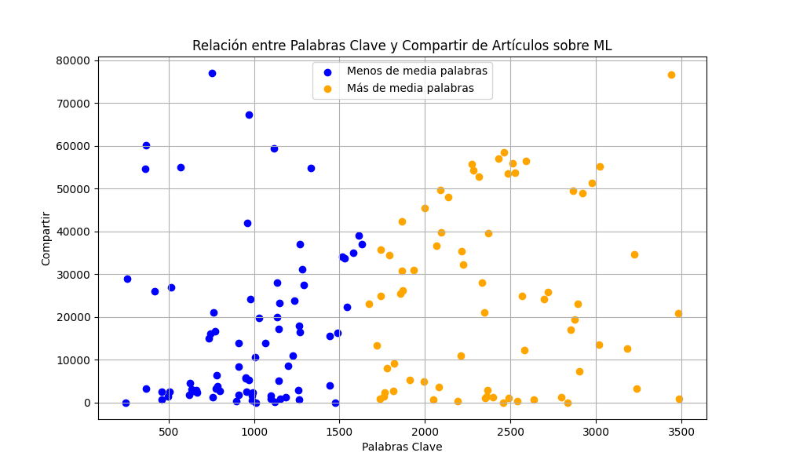

## Regresión Lineal para Predicción de Compartir de Artículos sobre Machine Learning

El siguiente informe detalla el proceso y resultados obtenidos al aplicar regresión lineal para predecir el número de "compartir" que puede obtener un artículo sobre Machine Learning de 2000 palabras.

### 1. Carga de Datos desde Archivo CSV

El programa comienza cargando datos desde un archivo CSV `articulos_ml.csv`, donde se espera que las columnas contengan información relevante para nuestro análisis. En este caso, se cargan las columnas que representan las palabras clave del artículo y el número de "compartir".

```cpp
void loadCSV(const std::string& filename, std::vector<double>& col1, std::vector<double>& col2, int col1Index, int col2Index) {
    std::ifstream file(filename);

    if (!file.is_open()) {
        throw std::runtime_error("Could not open file");
    }

    std::string line;
    std::getline(file, line);
    while (std::getline(file, line)) {
        std::stringstream ss(line);
        std::string value;
        int colIndex = 0;
        double val1, val2;
        bool val1Set = false, val2Set = false;
        bool inQuotes = false;
        char c;

        value.clear();
        while (ss.get(c)) {
            if (c == '"') {
                inQuotes = !inQuotes;
            } else if (c == ',' && !inQuotes) {
                // When we encounter a comma and we are not inside quotes, we have a complete value
                if (colIndex == col1Index) {
                 
                    try {
                        val1 = std::stod(value);
                        val1Set = true;
                    } catch (const std::invalid_argument& e) {
                        std::cerr << "Invalid number in line: " << line << std::endl;
                    } catch (const std::out_of_range& e) {
                        std::cerr << "Number out of range in line: " << line << std::endl;
                    }
                }
                if (colIndex == col2Index) {
                
                    try {
                        val2 = std::stod(value);
                        val2Set = true;
                    } catch (const std::invalid_argument& e) {
                        std::cerr << "Invalid number in line: " << line << std::endl;
                    } catch (const std::out_of_range& e) {
                        std::cerr << "Number out of range in line: " << line << std::endl;
                    }
                }
                value.clear();
                ++colIndex;
            } else {
                value += c;
            }
        }

        // Handle the last value after the loop
        if (!value.empty()) {
            if (colIndex == col1Index) {
                
                try {
                    val1 = std::stod(value);
                    val1Set = true;
                } catch (const std::invalid_argument& e) {
                    std::cerr << "Invalid number in line: " << line << std::endl;
                } catch (const std::out_of_range& e) {
                    std::cerr << "Number out of range in line: " << line << std::endl;
                }
            }
            if (colIndex == col2Index) {
               
                try {
                    val2 = std::stod(value);
                    val2Set = true;
                } catch (const std::invalid_argument& e) {
                    std::cerr << "Invalid number in line: " << line << std::endl;
                } catch (const std::out_of_range& e) {
                    std::cerr << "Number out of range in line: " << line << std::endl;
                }
            }
        }

        if (val1Set && val2Set) {
            col1.push_back(val1);
            col2.push_back(val2);
        }
    }

    file.close();
}
```

En este método, se maneja la lectura del archivo CSV y se extraen los datos de las columnas específicas (`col1Index` y `col2Index`). Los valores de estas columnas se almacenan en vectores `col1` y `col2` respectivamente.

### 2. Filtrado de Datos

Para obtener resultados más precisos, se aplica un filtro a los datos cargados. En este caso, se seleccionan únicamente los registros donde el valor de la primera columna (`col1`) sea menor o igual a 3500 y el valor de la segunda columna (`col2`) sea menor o igual a 80000.

```cpp
void filterCSV(const std::vector<double>& col1, const std::vector<double>& col2, std::vector<double>& filteredCol1, std::vector<double>& filteredCol2, double col1Max, double col2Max) {
    for (size_t i = 0; i < col1.size(); ++i) {
        if (col1[i] <= col1Max && col2[i] <= col2Max) {
            filteredCol1.push_back(col1[i]);
            filteredCol2.push_back(col2[i]);
        }
    }
}
```

Esto se logra utilizando la función `filterCSV`, que recorre los vectores de columnas originales y copia los registros que cumplen con los criterios de filtro a vectores `filteredCol1` y `filteredCol2`.

#### Resultados del Filtrado
A continuación se muestra la gráfica que visualiza la relación entre las palabras clave y el número de compartidos, después de aplicar el filtro:


En la gráfica, los puntos en azul representan los artículos con menos de 1808 palabras (la media), mientras que los puntos en naranja corresponden a los artículos con más palabras.




#### Guardar y Visualizar

Guarda los cambios en tu archivo Markdown y asegúrate de tener la imagen `grafica_compartir_vs_palabras.png

### 3. Regresión Lineal

Con los datos filtrados, se procede a aplicar regresión lineal para modelar la relación entre las palabras clave del artículo y el número de "compartir".

#### Atributos y Métodos de la Clase `LinearRegression`

La clase `LinearRegression` contiene los siguientes atributos y métodos relevantes para el cálculo de la regresión lineal:

**Atributos:**
- `sumX`: Suma de los valores de la variable independiente $ x $.
- `sumY`: Suma de los valores de la variable dependiente $ y $.
- `sumXY`: Suma de los productos $ x_i \cdot y_i $.
- `sumX2`: Suma de los cuadrados de $ x_i $.
- `sumY2`: Suma de los cuadrados de $ y_i $.

#### Métodos:

##### Inicializar los atirbutos
```cpp
private:
    void calculateSummations(const std::vector<double>& x, const std::vector<double>& y) {
        sumX = 0;
        sumY = 0;
        sumXY = 0;
        sumX2 = 0;
        sumY2 = 0;

        for (size_t i = 0; i < x.size(); ++i) {
            double xi = x[i];
            double yi = y[i];

            sumX += xi;
            sumY += yi;
            sumXY += xi * yi;
            sumX2 += xi * xi;
            sumY2 += yi * yi;
        }
    }
```
Este método calcula todas las sumatorias necesarias para los cálculos posteriores de la regresión lineal. Actualiza los atributos sumX, sumY, sumXY, sumX2 y sumY2 con los valores de los vectores x y y.

##### Calculando la Pendiente (m)

```cpp
double calculateM(const std::vector<double>& x, const std::vector<double>& y)
{
    calculateSummations(x, y);
    int n = x.size();

    double numerator = (n * sumXY) - (sumX * sumY);
    double denominator = (n * sumX2) - (sumX * sumX);

    return numerator / denominator;
}
```

La pendiente `m` de la ecuación de regresión lineal se calcula utilizando la fórmula:

$ m = \frac{n \cdot \sum_{i=1}^{n} (x_i \cdot y_i) - \sum_{i=1}^{n} x_i \cdot \sum_{i=1}^{n} y_i}{n \cdot \sum_{i=1}^{n} (x_i^2) - (\sum_{i=1}^{n} x_i)^2}$

donde \( x_i \) son los valores de la primera columna (palabras clave), \( y_i \) son los valores de la segunda columna (compartir), y \( n \) es el número total de registros.

##### Calculando la Ordenada al Origen (b)

```cpp
double calculateB(const std::vector<double>& x, const std::vector<double>& y)
{
    calculateSummations(x, y);
    int n = x.size();

    double numerator = (sumY * sumX2) - (sumX * sumXY);
    double denominator = (n * sumX2) - (sumX * sumX);

    return numerator / denominator;
}
```

La ordenada al origen `b` se calcula utilizando la fórmula:

$ b = \frac{\sum_{i=1}^{n} (y_i) \cdot \sum_{i=1}^{n} (x_i^2) - \sum_{i=1}^{n} (x_i) \cdot \sum_{i=1}^{n} (x_i \cdot y_i)}{n \cdot \sum_{i=1}^{n} (x_i^2) - (\sum_{i=1}^{n} (x_i))^2} $

##### Calculando el Coeficiente de Correlación (r)

```cpp
double calculateR(const std::vector<double>& x, const std::vector<double>& y)
{
    calculateSummations(x, y);
    int n = x.size();

    double numerator = (n * sumXY) - (sumX * sumY);
    double denominator = std::sqrt((n * sumX2 - sumX * sumX) * (n * sumY2 - sumY * sumY));

    return numerator / denominator;
}
```

El coeficiente de correlación `r` se calcula para evaluar la fuerza y la dirección de la relación lineal entre las palabras clave y el número de "compartir". Se utiliza la fórmula:

$ r = \frac{n \cdot \sum_{i=1}^{n} (x_i \cdot y_i) - \sum_{i=1}^{n} (x_i) \cdot \sum_{i=1}^{n} (y_i)}{\sqrt{[n \cdot \sum_{i=1}^{n} (x_i^2) - (\sum_{i=1}^{n} (x_i))^2] \cdot [n \cdot \sum_{i=1}^{n} (y_i^2) - (\sum_{i=1}^{n} (y_i))^2]}} $

### 4. Predicción de Compartir para un Artículo de 2000 Palabras

Para predecir cuántos "compartir" podría obtener un artículo sobre Machine Learning de 2000 palabras, utilizamos la ecuación de regresión lineal obtenida:

$ \text{Compartir} = m \cdot 2000 + b $

donde $ m $ es la pendiente y $ b $ es la ordenada al origen calculadas previamente.

### Resultados y Conclusiones

Después de aplicar la regresión lineal y los cálculos correspondientes, se obtienen los siguientes resultados:
```cpp
double predictResult(double x, double m, double b)
{
    return (m*x + b);
}
```

- Pendiente (m): 5.69765
- Ordenada al origen (b): 11200.3
- Coeficiente de correlación (r): 0.234943
- Ecuación de regresión lineal (y): $ m \cdot 2000 + b $
    - Resultado (y): 22595.6

Estos resultados nos permiten hacer predicciones basadas en la relación identificada entre las palabras clave y el número de "compartir" en artículos sobre Machine Learning.

Este informe proporciona una visión clara del proceso utilizado para aplicar regresión lineal y predecir el número de "compartir" para un artículo específico, demostrando la utilidad de las técnicas estadísticas en el análisis de datos prácticos como este.
